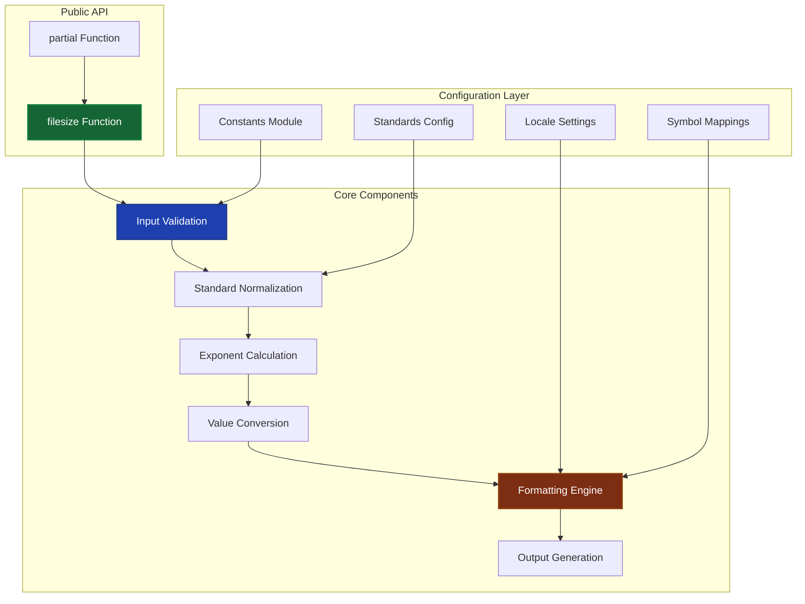
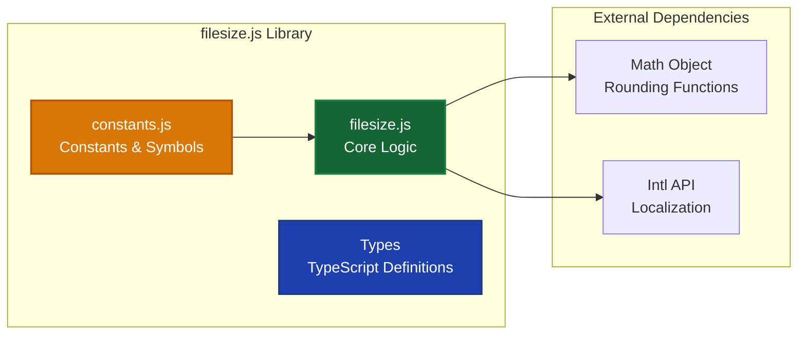
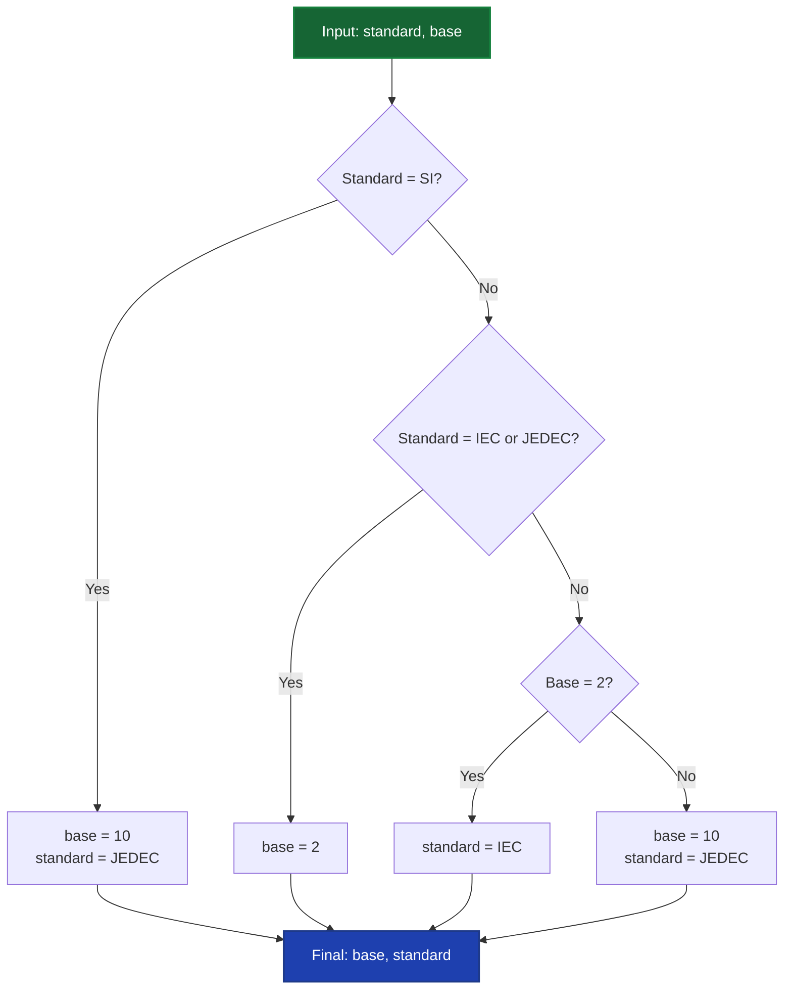
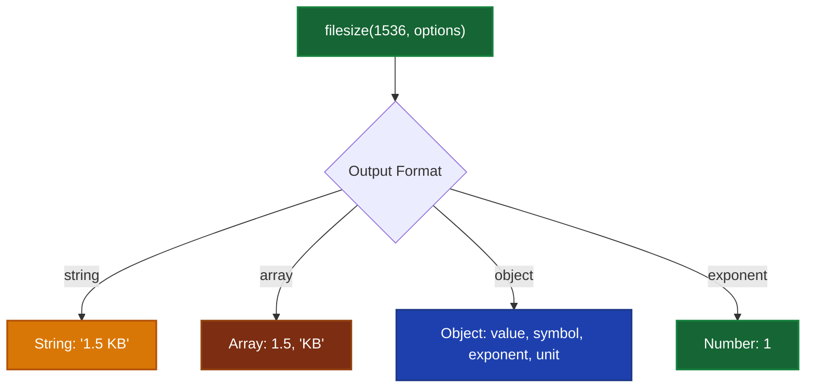
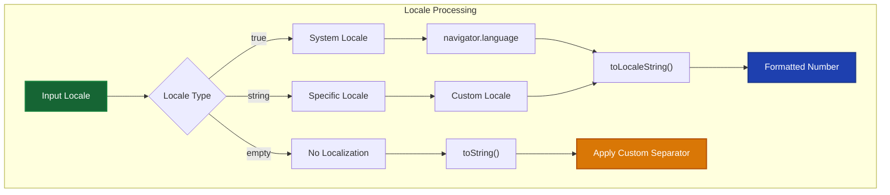
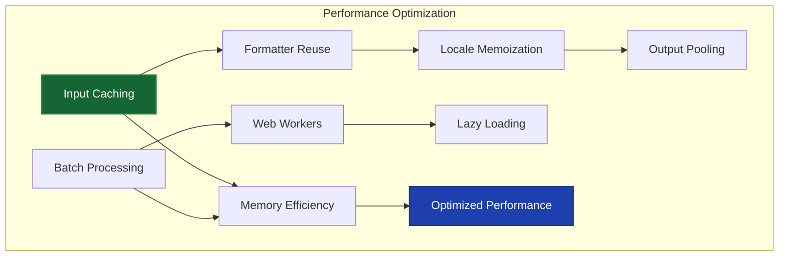

# Technical Documentation

## Table of Contents

1. [Overview](#overview)
2. [Architecture](#architecture)
3. [Mathematical Foundation](#mathematical-foundation)
4. [Data Flow](#data-flow)
5. [API Reference](#api-reference)
6. [Usage Patterns](#usage-patterns)
7. [Modern Application Examples (2025)](#modern-application-examples-2025)
8. [Internationalization & Localization](#internationalization--localization)
9. [Performance Considerations](#performance-considerations)
10. [Integration Patterns](#integration-patterns)
11. [Troubleshooting](#troubleshooting)

## Overview

**filesize.js** is a modern JavaScript library that converts numeric byte values into human-readable file size strings with extensive customization options. The library supports multiple unit standards, localization, and various output formats, making it ideal for modern web applications, mobile apps, and cloud platforms.

### Key Features

- **Multiple Unit Standards**: SI (decimal), IEC (binary), and JEDEC standards
- **Localization Support**: Full internationalization with locale-specific formatting
- **Flexible Output**: String, Array, Object, or Exponent formats
- **BigInt Support**: Handle extremely large file sizes
- **Customizable Formatting**: Precision, rounding, symbols, and spacing control
- **Functional Programming**: Partial application support for configuration reuse

### Browser & Runtime Support

- **Node.js**: 10.4.0+
- **Modern Browsers**: ES6+ support required
- **Mobile**: iOS Safari 10+, Android Chrome 51+
- **Server Environments**: Deno, Bun, Cloudflare Workers

## Architecture

### System Architecture



### Module Structure



## Mathematical Foundation

The filesize.js library implements several mathematical algorithms to convert raw byte values into human-readable format with appropriate units. This section describes the core mathematical formulas and their implementations.

### Fundamental Conversion Formula

The basic conversion from bytes to higher-order units follows the general formula:

```math
\text{value} = \frac{\text{bytes}}{\text{base}^{\text{exponent}}}
```

Where:
- $\text{bytes}$ is the input byte value
- $\text{base}$ is either 2 (binary) or 10 (decimal) depending on the standard
- $\text{exponent}$ determines the unit scale (0=bytes, 1=KB/KiB, 2=MB/MiB, etc.)

### Exponent Calculation

The appropriate exponent for automatic unit selection is calculated using logarithms:

```math
e = \lfloor \log_{\text{base}}(\text{bytes}) \rfloor
```

For implementation efficiency, this is computed using the change of base formula:

```math
e = \left\lfloor \frac{\ln(\text{bytes})}{\ln(\text{base})} \right\rfloor
```

Where:
- $\ln$ is the natural logarithm
- $\lfloor \cdot \rfloor$ is the floor function
- $\text{base} = 1024$ for binary (IEC) standard
- $\text{base} = 1000$ for decimal (SI/JEDEC) standards

### Binary vs Decimal Standards

#### Binary Standard (IEC)
Uses powers of 2 with base 1024:

```math
\text{value} = \frac{\text{bytes}}{2^{10 \cdot e}} = \frac{\text{bytes}}{1024^e}
```

Units: B, KiB, MiB, GiB, TiB, PiB, EiB, ZiB, YiB

#### Decimal Standard (SI/JEDEC)
Uses powers of 10 with base 1000:

```math
\text{value} = \frac{\text{bytes}}{10^{3 \cdot e}} = \frac{\text{bytes}}{1000^e}
```

Units: B, KB, MB, GB, TB, PB, EB, ZB, YB

### Bits Conversion

When converting to bits instead of bytes, the formula becomes:

```math
\text{value}_{\text{bits}} = \frac{8 \cdot \text{bytes}}{\text{base}^e}
```

This multiplication by 8 reflects the conversion from bytes to bits (1 byte = 8 bits).

### Precision and Rounding

#### Decimal Rounding
The rounding operation applies a power-of-10 scaling factor:

```math
\text{rounded\_value} = \frac{\text{round}(\text{value} \cdot 10^r)}{10^r}
```

Where $r$ is the number of decimal places specified by the `round` parameter.

#### Significant Digits (Precision)
When precision is specified ($p > 0$), the value is adjusted to show $p$ significant digits after rounding:

```math
\text{precise\_value} = \text{toPrecision}(\text{rounded\_value}, p)
```

The precision parameter takes precedence over round when both are specified. If scientific notation results (contains 'E'), the exponent is incremented and the calculation is repeated to avoid exponential notation in output.

### Overflow Handling

When a calculated value equals or exceeds the base threshold, the algorithm increments the exponent:

```math
\text{if } \text{value} \geq \text{base} \text{ and } e < 8 \text{ then:}
```
```math
\begin{cases}
\text{value} = 1 \\
e = e + 1
\end{cases}
```

This ensures proper unit progression (e.g., 1024 KB becomes 1 MB).

### Exponent Boundary Conditions

The library enforces boundaries on the exponent:

```math
e = \begin{cases}
0 & \text{if } e < 0 \\
8 & \text{if } e > 8 \\
e & \text{otherwise}
\end{cases}
```

For exponents exceeding 8, precision adjustment occurs:

```math
\text{precision}_{\text{adjusted}} = \text{precision} + (8 - e_{\text{original}})
```

### Special Cases

#### Zero Input
When the input is zero:

```math
\text{value} = 0, \quad e = 0, \quad \text{unit} = \text{base unit}
```

#### Negative Input
For negative inputs, the absolute value is processed and the sign is preserved:

```math
\text{result} = -\left|\text{filesize}(|\text{bytes}|, \text{options})\right|
```

### Mathematical Complexity

The algorithmic complexity of the conversion process is:

- **Time Complexity**: $O(1)$ - constant time for all operations
- **Space Complexity**: $O(1)$ - constant space usage
- **Numerical Precision**: IEEE 754 double precision for values up to $2^{53} - 1$

### Implementation Examples

#### Default Conversion (1536 bytes)
Given: bytes = 1536, default settings (base = 10, JEDEC standard)

1. Calculate exponent: $e = \lfloor \log_{1000}(1536) \rfloor = \lfloor 1.062 \rfloor = 1$
2. Calculate value: $\text{value} = \frac{1536}{1000^1} = 1.536$
3. Apply rounding (2 decimal places): $1.536 \rightarrow 1.54$
4. Result: "1.54 kB"

#### Binary Conversion (1536 bytes)
Given: bytes = 1536, base = 2 (IEC standard)

1. Calculate exponent: $e = \lfloor \log_{1024}(1536) \rfloor = \lfloor 1.084 \rfloor = 1$
2. Calculate value: $\text{value} = \frac{1536}{1024^1} = 1.5$
3. Result: "1.5 KiB"

#### Bits Conversion with Default Base (1024 bytes)
Given: bytes = 1024, bits = true, default settings (base = 10)

1. Calculate exponent: $e = \lfloor \log_{1000}(1024) \rfloor = \lfloor 1.003 \rfloor = 1$
2. Calculate value: $\text{value} = \frac{1024 \cdot 8}{1000^1} = 8.192$
3. Apply rounding (2 decimal places): $8.192 \rightarrow 8.19$
4. Result: "8.19 kbit"

#### Bits Conversion with Binary Base (1024 bytes)
Given: bytes = 1024, bits = true, base = 2

1. Calculate exponent: $e = \lfloor \log_{1024}(1024) \rfloor = 1$
2. Calculate value: $\text{value} = \frac{1024 \cdot 8}{1024^1} = 8$
3. Result: "8 Kibit"

## Data Flow

### Primary Processing Pipeline

```mermaid
flowchart TD
    Start([Input: bytes, options]) --> Validate{Valid Input?}
    
    Validate -->|No| Error[Throw TypeError]
    Validate -->|Yes| Normalize[Normalize Base & Standard]
    
    Normalize --> CalcExp[Calculate Exponent]
    CalcExp --> CheckExp{Exponent > 8?}
    CheckExp -->|Yes| LimitExp[Limit to 8, Adjust Precision]
    CheckExp -->|No| CheckZero{Input = 0?}
    LimitExp --> CheckZero
    
    CheckZero -->|Yes| ZeroCase[Set result = 0, unit = base unit]
    CheckZero -->|No| Convert[Convert Value & Calculate Unit]
    
    Convert --> CheckBits{Bits Mode?}
    CheckBits -->|Yes| MultiplyBy8[Multiply by 8]
    CheckBits -->|No| Round[Apply Rounding]
    MultiplyBy8 --> Round
    
    Round --> CheckOverflow{Value >= ceil?}
    CheckOverflow -->|Yes| Increment[Increment Exponent]
    CheckOverflow -->|No| Format[Apply Formatting]
    Increment --> Format
    
    ZeroCase --> Format
    
    Format --> Locale{Locale Set?}
    Locale -->|Yes| LocaleFormat[Apply Locale Formatting]
    Locale -->|No| Separator{Custom Separator?}
    LocaleFormat --> Padding
    Separator -->|Yes| CustomSep[Apply Custom Separator]
    Separator -->|No| Padding{Padding Enabled?}
    CustomSep --> Padding
    
    Padding -->|Yes| PadDecimal[Pad Decimal Places]
    Padding -->|No| FullForm{Full Form?}
    PadDecimal --> FullForm
    
    FullForm -->|Yes| ExpandUnit[Use Full Unit Names]
    FullForm -->|No| CustomSymbols{Custom Symbols?}
    ExpandUnit --> CustomSymbols
    
    CustomSymbols -->|Yes| ApplySymbols[Apply Custom Symbols]
    CustomSymbols -->|No| Output[Generate Output]
    ApplySymbols --> Output
    
    Output --> Return([Return: Formatted Result])
    
    style Start fill:#166534,stroke:#15803d,stroke-width:2px,color:#ffffff
    style Error fill:#dc2626,stroke:#b91c1c,stroke-width:2px,color:#ffffff
    style Return fill:#1e40af,stroke:#1e3a8a,stroke-width:2px,color:#ffffff
```



### Standard Selection Logic



## API Reference

### Core Functions

#### `filesize(arg, options)`

Converts bytes to human-readable format.

**Parameters:**
- `arg` (number|bigint): File size in bytes
- `options` (Object): Configuration options

**Returns:** string|Array|Object|number

#### `partial(options)`

Creates a partially applied function with preset options.

**Parameters:**
- `options` (Object): Default configuration

**Returns:** Function

### Configuration Options

| Option | Type | Default | Description |
|--------|------|---------|-------------|
| `bits` | boolean | `false` | Calculate bits instead of bytes |
| `pad` | boolean | `false` | Pad decimal places |
| `base` | number | `-1` | Number base (2, 10, or -1 for auto) |
| `round` | number | `2` | Decimal places to round |
| `locale` | string\|boolean | `""` | Locale for formatting |
| `localeOptions` | Object | `{}` | Additional locale options |
| `separator` | string | `""` | Custom decimal separator |
| `spacer` | string | `" "` | Value-unit separator |
| `symbols` | Object | `{}` | Custom unit symbols |
| `standard` | string | `""` | Unit standard (SI, IEC, JEDEC) |
| `output` | string | `"string"` | Output format |
| `fullform` | boolean | `false` | Use full unit names |
| `fullforms` | Array | `[]` | Custom full unit names |
| `exponent` | number | `-1` | Force specific exponent |
| `roundingMethod` | string | `"round"` | Math rounding method |
| `precision` | number | `0` | Significant digits |

### Output Formats



#### Output Format Examples

```javascript
// String output (default)
filesize(1536) // "1.5 KB"

// Array output
filesize(1536, { output: "array" }) // [1.5, "KB"]

// Object output
filesize(1536, { output: "object" })
// { value: 1.5, symbol: "KB", exponent: 1, unit: "KB" }

// Exponent output
filesize(1536, { output: "exponent" }) // 1
```

## Usage Patterns

### Basic Usage

```javascript
import { filesize } from 'filesize';

// Simple conversion
filesize(1024); // "1 KB"
filesize(1536); // "1.5 KB" 
filesize(1073741824); // "1 GB"
```

### Advanced Configuration

```javascript
// IEC binary standard
filesize(1024, { standard: "IEC" }); // "1 KiB"

// High precision
filesize(1536, { round: 3 }); // "1.500 KB"

// Bits instead of bytes
filesize(1024, { bits: true }); // "8 Kb"

// Object output for programmatic use
filesize(1536, { output: "object" });
// { value: 1.5, symbol: "KB", exponent: 1, unit: "KB" }
```

### Functional Programming Pattern

```javascript
import { partial } from 'filesize';

// Create specialized formatters
const formatBinary = partial({ standard: "IEC", round: 1 });
const formatPrecise = partial({ round: 4, pad: true });

formatBinary(1024); // "1.0 KiB"
formatPrecise(1536); // "1.5000 KB"
```

## Modern Application Examples (2025)

### 1. Cloud Storage Dashboard

```javascript
// components/StorageWidget.js
import { filesize, partial } from 'filesize';
import { useLocale } from '@/hooks/useLocale';

const formatStorage = partial({
  standard: "IEC",
  round: 1,
  output: "object"
});

function StorageWidget({ usage, quota }) {
  const { locale } = useLocale();
  
  const usageFormatted = filesize(usage, { 
    locale, 
    standard: "IEC",
    localeOptions: { notation: "compact" }
  });
  
  const quotaFormatted = filesize(quota, { 
    locale, 
    standard: "IEC" 
  });
  
  const percentage = (usage / quota) * 100;
  
  return (
    <div className="storage-widget">
      <div className="usage-bar" style={{ width: `${percentage}%` }} />
      <p>{usageFormatted} of {quotaFormatted} used</p>
    </div>
  );
}
```

### 2. File Upload Progress (React/Vue)

```javascript
// hooks/useFileUpload.js
import { filesize } from 'filesize';
import { useState, useCallback } from 'react';

export function useFileUpload() {
  const [uploads, setUploads] = useState([]);
  
  const formatBytes = useCallback((bytes, locale = 'en-US') => {
    return filesize(bytes, {
      locale,
      round: 1,
      localeOptions: {
        minimumFractionDigits: 1,
        maximumFractionDigits: 1
      }
    });
  }, []);
  
  const addUpload = useCallback((file) => {
    const upload = {
      id: crypto.randomUUID(),
      name: file.name,
      size: file.size,
      sizeFormatted: formatBytes(file.size),
      progress: 0,
      uploaded: 0
    };
    
    setUploads(prev => [...prev, upload]);
    return upload.id;
  }, [formatBytes]);
  
  const updateProgress = useCallback((id, uploaded) => {
    setUploads(prev => prev.map(upload => {
      if (upload.id === id) {
        const progress = (uploaded / upload.size) * 100;
        return {
          ...upload,
          uploaded,
          uploadedFormatted: formatBytes(uploaded),
          progress: Math.min(100, progress)
        };
      }
      return upload;
    }));
  }, [formatBytes]);
  
  return { uploads, addUpload, updateProgress };
}
```

### 3. Mobile App Data Usage Tracker

```javascript
// utils/dataTracker.js
import { filesize, partial } from 'filesize';

class DataUsageTracker {
  constructor(locale = 'en-US') {
    this.locale = locale;
    this.formatData = partial({
      bits: true,
      standard: "IEC",
      locale: this.locale,
      round: 1
    });
    
    this.formatBytes = partial({
      standard: "IEC", 
      locale: this.locale,
      round: 2
    });
  }
  
  // Format network speeds
  formatSpeed(bytesPerSecond) {
    const bitsPerSecond = bytesPerSecond * 8;
    return `${this.formatData(bitsPerSecond)}/s`;
  }
  
  // Format data consumption
  formatUsage(bytes) {
    return this.formatBytes(bytes);
  }
  
  // Generate usage report
  generateReport(dailyUsage) {
    const total = dailyUsage.reduce((sum, day) => sum + day.bytes, 0);
    const average = total / dailyUsage.length;
    
    return {
      total: this.formatUsage(total),
      average: this.formatUsage(average),
      peak: this.formatUsage(Math.max(...dailyUsage.map(d => d.bytes))),
      details: dailyUsage.map(day => ({
        ...day,
        formatted: this.formatUsage(day.bytes)
      }))
    };
  }
}

// Usage in React Native
export const dataTracker = new DataUsageTracker();
```

### 4. Progressive Web App (PWA) Cache Management

```javascript
// service-worker.js - Cache size monitoring
import { filesize } from 'filesize';

class CacheManager {
  async getCacheSize() {
    const cacheNames = await caches.keys();
    let totalSize = 0;
    
    for (const cacheName of cacheNames) {
      const cache = await caches.open(cacheName);
      const requests = await cache.keys();
      
      for (const request of requests) {
        const response = await cache.match(request);
        if (response) {
          const blob = await response.blob();
          totalSize += blob.size;
        }
      }
    }
    
    return {
      bytes: totalSize,
      formatted: filesize(totalSize, {
        standard: "IEC",
        round: 1
      })
    };
  }
  
  async cleanupCache(maxSize = 50 * 1024 * 1024) { // 50MB default
    const { bytes } = await this.getCacheSize();
    
    if (bytes > maxSize) {
      // Cleanup logic
      console.log(`Cache size ${filesize(bytes)} exceeds limit ${filesize(maxSize)}`);
      // Implementation...
    }
  }
}
```

### 5. Real-time System Monitoring Dashboard

```javascript
// components/SystemMetrics.tsx
import { filesize } from 'filesize';
import { useEffect, useState } from 'react';

interface SystemMetrics {
  memory: {
    used: number;
    total: number;
  };
  disk: {
    used: number;
    total: number;
  };
  network: {
    download: number;
    upload: number;
  };
}

export function SystemMetrics() {
  const [metrics, setMetrics] = useState<SystemMetrics | null>(null);
  const [locale] = useState(() => navigator.language);
  
  const formatMetric = (value: number, options = {}) => 
    filesize(value, {
      locale,
      standard: "IEC",
      round: 1,
      ...options
    });
  
  const formatSpeed = (bytesPerSecond: number) => 
    `${formatMetric(bytesPerSecond * 8, { bits: true })}/s`;
  
  useEffect(() => {
    const ws = new WebSocket('ws://localhost:8080/metrics');
    
    ws.onmessage = (event) => {
      const data = JSON.parse(event.data);
      setMetrics(data);
    };
    
    return () => ws.close();
  }, []);
  
  if (!metrics) return <div>Loading...</div>;
  
  return (
    <div className="metrics-grid">
      <MetricCard 
        title="Memory Usage"
        used={formatMetric(metrics.memory.used)}
        total={formatMetric(metrics.memory.total)}
        percentage={(metrics.memory.used / metrics.memory.total) * 100}
      />
      
      <MetricCard 
        title="Disk Usage"
        used={formatMetric(metrics.disk.used)}
        total={formatMetric(metrics.disk.total)}
        percentage={(metrics.disk.used / metrics.disk.total) * 100}
      />
      
      <NetworkCard 
        download={formatSpeed(metrics.network.download)}
        upload={formatSpeed(metrics.network.upload)}
      />
    </div>
  );
}
```

## Internationalization & Localization

### Global Locale Support



### Localization Examples

```javascript
// Multi-language file size formatting
const localizedFormatters = {
  'en-US': partial({ locale: 'en-US', standard: "JEDEC" }),
  'en-GB': partial({ locale: 'en-GB', standard: "IEC" }),
  'de-DE': partial({ locale: 'de-DE', standard: "IEC", separator: ',' }),
  'fr-FR': partial({ locale: 'fr-FR', standard: "SI" }),
  'ja-JP': partial({ locale: 'ja-JP', standard: "IEC" }),
  'zh-CN': partial({ locale: 'zh-CN', standard: "IEC" }),
  'ar-SA': partial({ locale: 'ar-SA', standard: "IEC" })
};

// Usage in internationalized app
function formatFileSize(bytes, userLocale = 'en-US') {
  const formatter = localizedFormatters[userLocale] || localizedFormatters['en-US'];
  return formatter(bytes);
}

// Examples
formatFileSize(1536, 'en-US'); // "1.5 KB"
formatFileSize(1536, 'de-DE'); // "1,5 KB" (German decimal separator)
formatFileSize(1536, 'fr-FR'); // "1,5 ko" (French locale)
```

### Advanced Locale Configuration

```javascript
// Custom locale options for different regions
const regionConfigs = {
  europe: {
    locale: 'en-GB',
    standard: 'IEC',
    localeOptions: {
      minimumFractionDigits: 1,
      maximumFractionDigits: 2
    }
  },
  
  asia: {
    locale: 'ja-JP',
    standard: 'IEC',
    localeOptions: {
      notation: 'compact',
      compactDisplay: 'short'
    }
  },
  
  americas: {
    locale: 'en-US',
    standard: 'JEDEC',
    localeOptions: {
      style: 'decimal'
    }
  }
};

// Context-aware formatting
class LocalizedFileSize {
  constructor(region = 'americas') {
    this.config = regionConfigs[region];
    this.formatter = partial(this.config);
  }
  
  format(bytes) {
    return this.formatter(bytes);
  }
  
  formatWithContext(bytes, context = 'storage') {
    const contextOptions = {
      storage: { standard: 'IEC' },
      network: { bits: true, standard: 'SI' },
      memory: { standard: 'IEC', round: 0 }
    };
    
    return filesize(bytes, {
      ...this.config,
      ...contextOptions[context]
    });
  }
}
```

### RTL Language Support

```javascript
// Right-to-left language support
function formatWithDirection(bytes, locale) {
  const rtlLocales = ['ar', 'he', 'fa', 'ur'];
  const isRTL = rtlLocales.some(lang => locale.startsWith(lang));
  
  const formatted = filesize(bytes, { locale });
  
  if (isRTL) {
    // For RTL languages, you might want to adjust spacing or direction
    return `<span dir="ltr">${formatted}</span>`;
  }
  
  return formatted;
}
```

## Performance Considerations

### Optimization Strategies



### Optimized Usage Patterns

```javascript
// 1. Formatter Reuse
const commonFormatter = partial({
  standard: "IEC",
  round: 1,
  locale: "en-US"
});

// Reuse instead of creating new options each time
const sizes = [1024, 2048, 4096].map(commonFormatter);

// 2. Memoization for expensive operations
const memoizedFilesize = (() => {
  const cache = new Map();
  
  return (bytes, options = {}) => {
    const key = `${bytes}-${JSON.stringify(options)}`;
    
    if (cache.has(key)) {
      return cache.get(key);
    }
    
    const result = filesize(bytes, options);
    cache.set(key, result);
    
    // Prevent memory leaks
    if (cache.size > 1000) {
      const firstKey = cache.keys().next().value;
      cache.delete(firstKey);
    }
    
    return result;
  };
})();

// 3. Batch processing for large datasets
function formatFileSizes(files, options = {}) {
  const formatter = partial(options);
  return files.map(file => ({
    ...file,
    sizeFormatted: formatter(file.size)
  }));
}

// 4. Web Worker for heavy processing
// worker.js
self.onmessage = function(e) {
  const { files, options } = e.data;
  
  importScripts('./filesize.js');
  
  const formatted = files.map(file => ({
    id: file.id,
    size: filesize(file.size, options)
  }));
  
  self.postMessage(formatted);
};
```

## Integration Patterns

### Framework-Specific Integrations

#### React Hook

```javascript
// hooks/useFilesize.js
import { filesize, partial } from 'filesize';
import { useMemo, useCallback } from 'react';

export function useFilesize(options = {}) {
  const formatter = useMemo(() => partial(options), [options]);
  
  const format = useCallback((bytes) => {
    if (typeof bytes !== 'number' && typeof bytes !== 'bigint') {
      return 'Invalid size';
    }
    
    try {
      return formatter(bytes);
    } catch (error) {
      console.error('Filesize formatting error:', error);
      return 'Error';
    }
  }, [formatter]);
  
  return { format, formatter };
}

// Usage
function FileList({ files }) {
  const { format } = useFilesize({ 
    standard: 'IEC', 
    locale: navigator.language 
  });
  
  return (
    <ul>
      {files.map(file => (
        <li key={file.id}>
          {file.name} - {format(file.size)}
        </li>
      ))}
    </ul>
  );
}
```

#### Vue Composable

```javascript
// composables/useFilesize.js
import { filesize, partial } from 'filesize';
import { computed, ref } from 'vue';

export function useFilesize(defaultOptions = {}) {
  const options = ref(defaultOptions);
  
  const formatter = computed(() => partial(options.value));
  
  const format = (bytes) => {
    try {
      return formatter.value(bytes);
    } catch (error) {
      console.error('Filesize error:', error);
      return 'Error';
    }
  };
  
  const updateOptions = (newOptions) => {
    options.value = { ...options.value, ...newOptions };
  };
  
  return {
    format,
    options: readonly(options),
    updateOptions
  };
}
```

#### Angular Service

```typescript
// services/filesize.service.ts
import { Injectable } from '@angular/core';
import { filesize, partial } from 'filesize';

@Injectable({
  providedIn: 'root'
})
export class FilesizeService {
  private formatters = new Map<string, Function>();
  
  getFormatter(options: any = {}): Function {
    const key = JSON.stringify(options);
    
    if (!this.formatters.has(key)) {
      this.formatters.set(key, partial(options));
    }
    
    return this.formatters.get(key)!;
  }
  
  format(bytes: number | bigint, options: any = {}): string {
    return this.getFormatter(options)(bytes);
  }
  
  formatWithLocale(bytes: number | bigint, locale: string): string {
    return this.format(bytes, { locale, standard: 'IEC' });
  }
}
```

### Server-Side Integration

```javascript
// Express.js middleware
function filesizeMiddleware(options = {}) {
  const formatter = partial(options);
  
  return (req, res, next) => {
    res.formatFilesize = (bytes) => formatter(bytes);
    next();
  };
}

// Usage
app.use(filesizeMiddleware({ standard: 'IEC', locale: 'en-US' }));

app.get('/api/files', (req, res) => {
  const files = getFiles().map(file => ({
    ...file,
    sizeFormatted: res.formatFilesize(file.size)
  }));
  
  res.json(files);
});
```

## Troubleshooting

### Common Issues and Solutions

#### Issue: Inconsistent Output Across Locales

```javascript
// Problem: Different locales produce different decimal separators
filesize(1536, { locale: 'en-US' }); // "1.5 KB"
filesize(1536, { locale: 'de-DE' }); // "1,5 KB"

// Solution: Normalize for API consistency
function normalizedFilesize(bytes, options = {}) {
  const result = filesize(bytes, options);
  
  // If you need consistent decimal separators for APIs
  if (options.normalizeDecimal) {
    return result.replace(',', '.');
  }
  
  return result;
}
```

#### Issue: BigInt Support in Older Environments

```javascript
// Problem: BigInt not supported in older browsers

// Solution: Graceful fallback
function safeBigIntFilesize(value, options = {}) {
  try {
    return filesize(value, options);
  } catch (error) {
    if (error.message.includes('BigInt')) {
      // Convert BigInt to number with potential precision loss warning
      const num = Number(value);
      if (num === Infinity) {
        return 'Size too large';
      }
      return filesize(num, options);
    }
    throw error;
  }
}
```

#### Issue: Performance with Large Datasets

```javascript
// Problem: Formatting thousands of file sizes is slow

// Solution: Virtual scrolling with memoization
class VirtualizedFileSizeFormatter {
  constructor(options = {}) {
    this.formatter = partial(options);
    this.cache = new Map();
    this.maxCacheSize = 1000;
  }
  
  format(bytes) {
    if (this.cache.has(bytes)) {
      return this.cache.get(bytes);
    }
    
    const result = this.formatter(bytes);
    
    if (this.cache.size >= this.maxCacheSize) {
      const firstKey = this.cache.keys().next().value;
      this.cache.delete(firstKey);
    }
    
    this.cache.set(bytes, result);
    return result;
  }
  
  batchFormat(bytesArray) {
    return bytesArray.map(bytes => this.format(bytes));
  }
}
```

### Debugging Tools

```javascript
// Debug helper for troubleshooting
function debugFilesize(bytes, options = {}) {
  console.group('Filesize Debug');
  console.log('Input:', bytes, typeof bytes);
  console.log('Options:', options);
  
  try {
    const result = filesize(bytes, { ...options, output: 'object' });
    console.log('Parsed result:', result);
    
    const stringResult = filesize(bytes, options);
    console.log('Final output:', stringResult);
    
    return stringResult;
  } catch (error) {
    console.error('Error:', error);
    throw error;
  } finally {
    console.groupEnd();
  }
}
```

### Error Handling Best Practices

```javascript
// Comprehensive error handling wrapper
function robustFilesize(bytes, options = {}, fallback = 'Unknown size') {
  try {
    // Input validation
    if (bytes == null) {
      throw new Error('Input cannot be null or undefined');
    }
    
    // Type coercion with warnings
    if (typeof bytes === 'string') {
      const parsed = parseFloat(bytes);
      if (isNaN(parsed)) {
        throw new Error('String input could not be parsed as number');
      }
      console.warn('String input converted to number:', bytes, '→', parsed);
      bytes = parsed;
    }
    
    return filesize(bytes, options);
    
  } catch (error) {
    console.error('Filesize error:', error.message, { bytes, options });
    
    // Return fallback instead of throwing
    return fallback;
  }
}
```

---

## Conclusion

This technical documentation provides a comprehensive guide to integrating filesize.js into modern applications. The library's flexibility, performance optimizations, and internationalization support make it ideal for 2025's global, multi-platform applications.

For additional support, examples, or contributions, visit the [project repository](https://github.com/avoidwork/filesize.js) or refer to the [API documentation](./API_REFERENCE.md). 